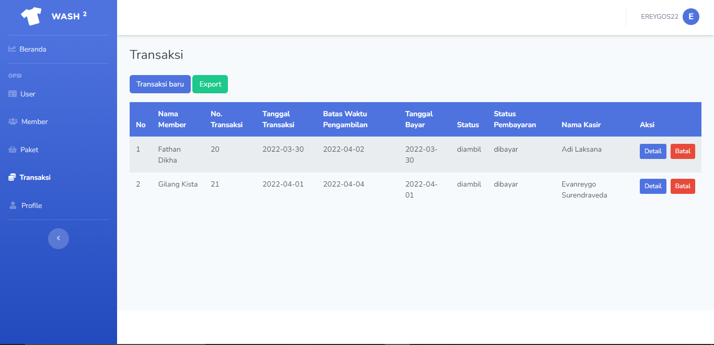

# Laundry

Projek ini merupakan sebuah aplikasi laundry sederhana berbasis web dengan menggunakan laravel. Projek ini merupakan projek akhir di kelas 12.

# Tampilan web

`Welcome Page`

`Login Page`

`Dashboard`

`List User`

`Tambah Admin`

`Tambah Kasir`

`Tambah Owner`

`Edit User`

`List Member`

`Tambah Member`

`Edit Member`

`List Paket`

`Tambah Paket`

`Edit Paket`

`List Transaksi`

`Tambah Transaksi`

`Edit Transaksi`

`Bayar`

`Detail Transaksi`

`Tambah Detail`

`Edit Detail`

`Laporan Transaksi`

`Struk`

`Profil`

`Logout`

